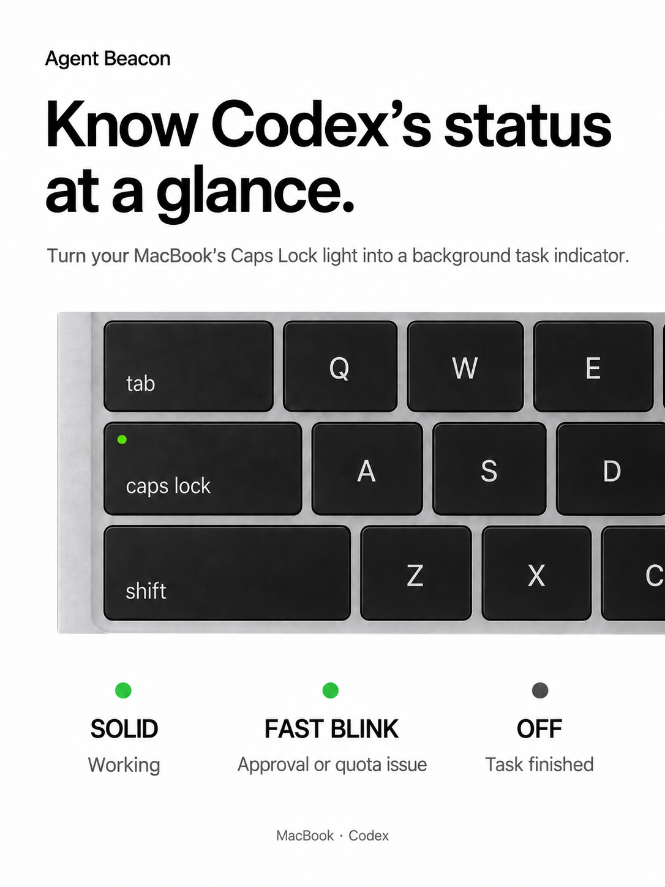

# Mac Agent Beacon

Use the Caps Lock LED on a MacBook as a status light for background Codex tasks.

**Solid = working · Fast blinking = needs attention · Off = finished**

Mac Agent Beacon runs locally and does not require an API key, cloud service,
Homebrew, or Node.js. It controls only the LED: it does not press keys, remap
Caps Lock, or change your agent's approval policy.

<p align="center">
  
</p>


## Features

| Agent state | Caps Lock LED |
| --- | --- |
| Working, automatically approved, or retrying | Solid |
| Waiting for user approval or structured input | Fast blinking |
| Quota exhausted, terminal network/permission error, or observer disconnected during active work | Fast blinking |
| Finished or idle | Off |

- Attention takes priority when several tasks are active.
- The LED returns to solid as soon as an approval is resolved.
- Ordinary text such as “reply approve and I will continue” is not inferred.
- Temporary network retries remain solid; only a terminal interruption alerts.
- Built for Codex Desktop, with lifecycle hooks shared with Codex CLI.

## Requirements

- macOS with a supported built-in Apple keyboard and Caps Lock LED
- Xcode Command Line Tools or Xcode
- System Ruby 2.6 or newer, SQLite, Git, and Make
- Codex installed and signed in

External and Magic Keyboards are not currently supported. Karabiner-Elements may
block LED access if it exclusively grabs the built-in keyboard. If Caps Lock still
controls capitalization or input sources, macOS may also update the same LED.

## Install

### 1. Install Apple's command-line tools

Skip this step if they are already installed.

```sh
xcode-select --install
```

Complete the macOS installer before continuing.

### 2. Install Mac Agent Beacon

Run this command in Terminal. Do not use `sudo`.

```sh
curl -fsSL https://raw.githubusercontent.com/rynzh/Mac-Agent-Beacon/main/install.sh | /bin/bash -s -- --repo https://github.com/rynzh/Mac-Agent-Beacon.git
```

Prefer to inspect the source first?

```sh
git clone https://github.com/rynzh/Mac-Agent-Beacon.git
cd Mac-Agent-Beacon
bash install.sh
```

The installer checks dependencies, builds and tests the LED helper, installs the
app under `~/Library/Application Support/AgentBeacon/`, merges the Codex hooks
without removing existing ones, and starts a per-user background service.

### 3. Allow LED access

Open **System Settings → Privacy & Security → Input Monitoring**.

Add and enable:

```text
~/Library/Application Support/AgentBeacon/app/build/beacon-led
```

In the file picker, press `Command-Shift-G`, paste the path, and select the file.
If macOS asks you to restart an app, save your work and restart it.

### 4. Trust the Codex hooks

Open Codex CLI, run `/hooks`, and review the new Agent Beacon hooks. Trust entries
whose command ends with:

```text
AgentBeacon/app/bin/agent-beacon.rb hook codex
```

These manual approvals are intentionally not bypassed by the installer.

### 5. Start a new task

Open Codex Desktop and start a task. The LED should stay solid while Codex works,
blink when Codex is genuinely waiting for your action, and turn off when the task
finishes.

## Check the installation

```sh
"$HOME/Library/Application Support/AgentBeacon/app/bin/beacon" status
```

A healthy active session normally reports a running controller, real rather than
simulated output, and a connected live observer.

To test the physical LED directly:

```sh
BEACON_DIR="$HOME/Library/Application Support/AgentBeacon/app"
"$BEACON_DIR/bin/beacon" stop
"$BEACON_DIR/bin/beacon" demo
"$BEACON_DIR/bin/beacon" service restart
```

Stop the controller before the demo so two processes do not compete for the LED.

## Uninstall

```sh
BEACON_DIR="$HOME/Library/Application Support/AgentBeacon/app"
"$BEACON_DIR/bin/beacon" uninstall-hooks codex
"$BEACON_DIR/bin/beacon" service remove
```

The commands remove the integrations and service but keep logs and backups. The
remaining `~/Library/Application Support/AgentBeacon/` folder can be moved to
Trash manually.

## How it works

- A Ruby controller combines task state from Codex hooks.
- Codex Desktop approval waits are detected through a read-only local IPC observer.
- Terminal failures are classified from Codex's local SQLite state.
- A small C helper uses macOS IOKit/IOHID to write the built-in Caps Lock LED.
- A LaunchAgent keeps the controller running after login.

The helper targets the LED output directly and does not inject a Caps Lock
keypress. On graceful exit, it restores the physical light to the current logical
Caps Lock state.

Codex Desktop IPC and database formats are internal interfaces and may change
after a Codex update. Runtime data stays on the Mac. Conversation snapshots may be
parsed in memory for state detection, but prompts, responses, and tool arguments
are not stored or uploaded by Mac Agent Beacon.

## Development

```sh
make test
```

See [CONTRIBUTING.md](CONTRIBUTING.md), [SECURITY.md](SECURITY.md), and the
[approval verification notes](docs/APPROVAL-VERIFICATION.md).

## License

[MIT](LICENSE). The LED helper includes adapted CapsPulse code; see
[THIRD_PARTY_NOTICES.md](THIRD_PARTY_NOTICES.md).
